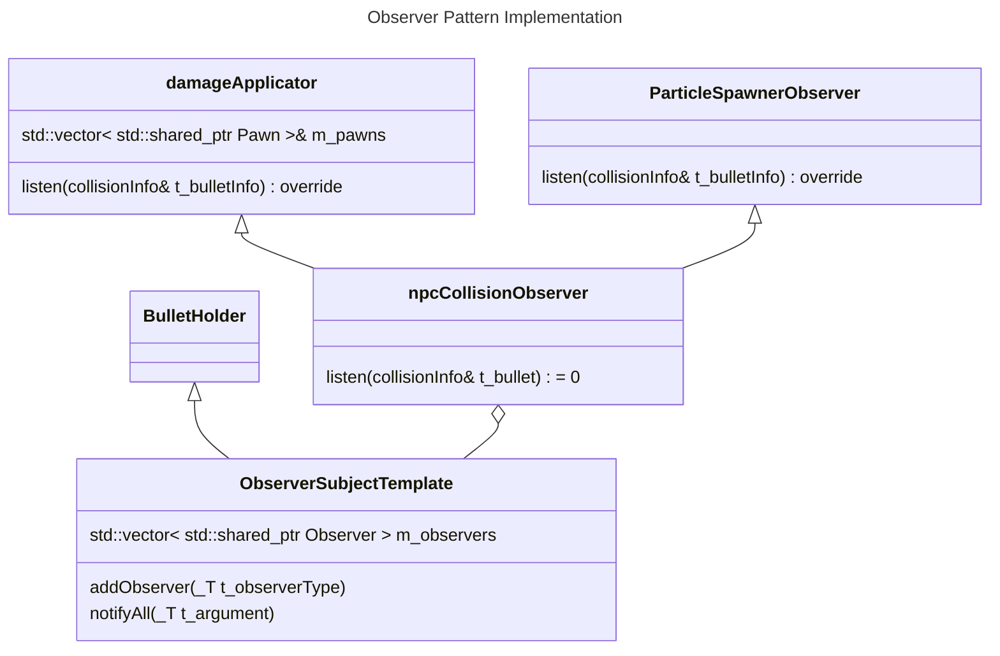
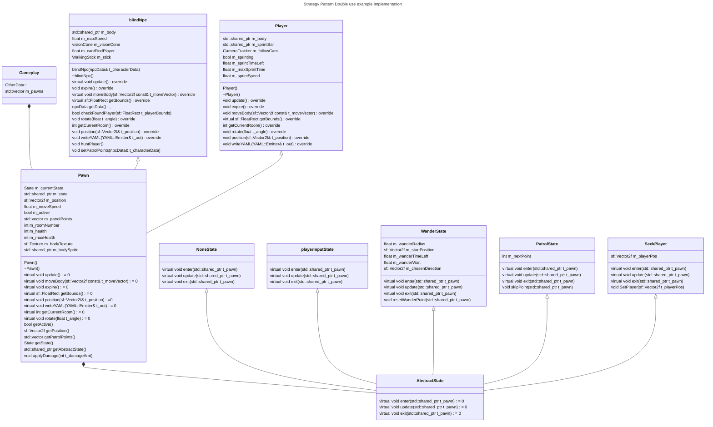

```mermaid
---
title: Observer Pattern Implementation
---
classDiagram
    BulletHolder <|-- ObserverSubjectTemplate
    damageApplicator <|-- npcCollisionObserver
    ParticleSpawnerObserver <|-- npcCollisionObserver
    npcCollisionObserver o-- ObserverSubjectTemplate
    

    class ObserverSubjectTemplate{
        addObserver(_T t_observerType)
        notifyAll(_T t_argument)
        std::vector< std::shared_ptr Observer > m_observers
    }
    class npcCollisionObserver{
    listen(collisionInfo& t_bullet) = 0
    }
    class damageApplicator{
	listen(collisionInfo& t_bulletInfo)override
	std::vector< std::shared_ptr Pawn >& m_pawns
    }
    class ParticleSpawnerObserver{
	listen(collisionInfo& t_bulletInfo)override
    }
    class BulletHolder{

    }
```

```mermaid
---
title: Strategy Pattern Double use example Implementation
---
classDiagram
    Pawn *-- AbstractState
    Gameplay *-- Pawn
    NoneState <|-- AbstractState
    playerInputState <|-- AbstractState
    WanderState <|-- AbstractState
    PatrolState <|-- AbstractState
    SeekPlayer <|-- AbstractState
    blindNpc <|-- Pawn
    Player <|-- Pawn

    class Pawn{
	Pawn()
	~Pawn()

	virtual void update() = 0
	virtual void moveBody(sf::Vector2f const& t_moveVector) = 0
	virtual void expire() = 0
    virtual sf::FloatRect getBounds() = 0
    virtual void position(sf::Vector2f& t_position)=0
	virtual void writeYAML(YAML::Emitter& t_out) = 0
	virtual int getCurrentRoom() = 0
    virtual void rotate(float t_angle) = 0


	bool getActive() 
	sf::Vector2f getPosition()
	std::vector<sf::Vector2f> getPatrolPoints() 
	State getState() 
	std::shared_ptr<AbstractState> getAbstractState()
	void applyDamage(int t_damageAmt)


    State m_currentState
	std::shared_ptr<AbstractState> m_state
	sf::Vector2f m_position
	float m_moveSpeed
	bool m_active
	std::vector<sf::Vector2f> m_patrolPoints
	int m_roomNumber
	int m_health
	int m_maxHealth
	sf::Texture m_bodyTexture
	std::shared_ptr<AnimatedSprite> m_bodySprite
    }

    class AbstractState{
	virtual void enter(std::shared_ptr<Pawn> t_pawn) = 0
	virtual void update(std::shared_ptr<Pawn> t_pawn) = 0
	virtual void exit(std::shared_ptr<Pawn> t_pawn) = 0
    }
    class NoneState{
	virtual void enter(std::shared_ptr<Pawn> t_pawn)
	virtual void update(std::shared_ptr<Pawn> t_pawn)
	virtual void exit(std::shared_ptr<Pawn> t_pawn)
    }

    class playerInputState{
	virtual void enter(std::shared_ptr<Pawn> t_pawn)
	virtual void update(std::shared_ptr<Pawn> t_pawn)
	virtual void exit(std::shared_ptr<Pawn> t_pawn)
    }

    class WanderState {
	virtual void enter(std::shared_ptr<Pawn> t_pawn)
	virtual void update(std::shared_ptr<Pawn> t_pawn)
	virtual void exit(std::shared_ptr<Pawn> t_pawn)

	void resetWanderPoint(std::shared_ptr<Pawn> t_pawn)

	float m_wanderRadius
	sf::Vector2f m_startPosition
	float m_wanderTimeLeft
	float m_wanderWait
	sf::Vector2f m_chosenDirection
    }

    class PatrolState{
	virtual void enter(std::shared_ptr<Pawn> t_pawn)
	virtual void update(std::shared_ptr<Pawn> t_pawn)
	virtual void exit(std::shared_ptr<Pawn> t_pawn)

	void skipPoint(std::shared_ptr<Pawn> t_pawn)

	int m_nextPoint
    }

    class SeekPlayer{
	virtual void enter(std::shared_ptr<Pawn> t_pawn)
	virtual void update(std::shared_ptr<Pawn> t_pawn)
	virtual void exit(std::shared_ptr<Pawn> t_pawn)

	void SetPlayer(sf::Vector2f t_playerPos)

	sf::Vector2f m_playerPos
    }

    class blindNpc{
	blindNpc(npcData& t_characterData)
	~blindNpc()
	virtual void update()override
	void expire()override
	virtual void moveBody(sf::Vector2f const& t_moveVector)override
	virtual sf::FloatRect getBounds()override 
	npcData getData();
	bool checkFoundPlayer(sf::FloatRect t_playerBounds)
	void rotate(float t_angle)override
	int getCurrentRoom()override
	void position(sf::Vector2f& t_position) override
	void writeYAML(YAML::Emitter& t_out) override
	void huntPlayer()
	void setPatrolPoints(npcData& t_characterData)

	std::shared_ptr<body> m_body
	float m_maxSpeed
	visionCone m_visionCone
	float m_cantFindPlayer
	WalkingStick m_stick
    }

class Player{
	Player()
	~Player()
	void update()override

	void expire()override

	void moveBody(sf::Vector2f const& t_moveVector)override
	virtual sf::FloatRect getBounds()override
	int getCurrentRoom() override
	void rotate(float t_angle)override

	void position(sf::Vector2f& t_position) override
	void writeYAML(YAML::Emitter& t_out) override

	std::shared_ptr<sf::RectangleShape> m_body
	std::shared_ptr<bar> m_sprintBar

	CameraTracker m_followCam

	bool m_sprinting
	float m_sprintTimeLeft
	float m_maxSprintTime
	float m_sprintSpeed
}

class Gameplay{
    OtherData~
    std::vector<std::shared_ptr Pawn> m_pawns
}
```
