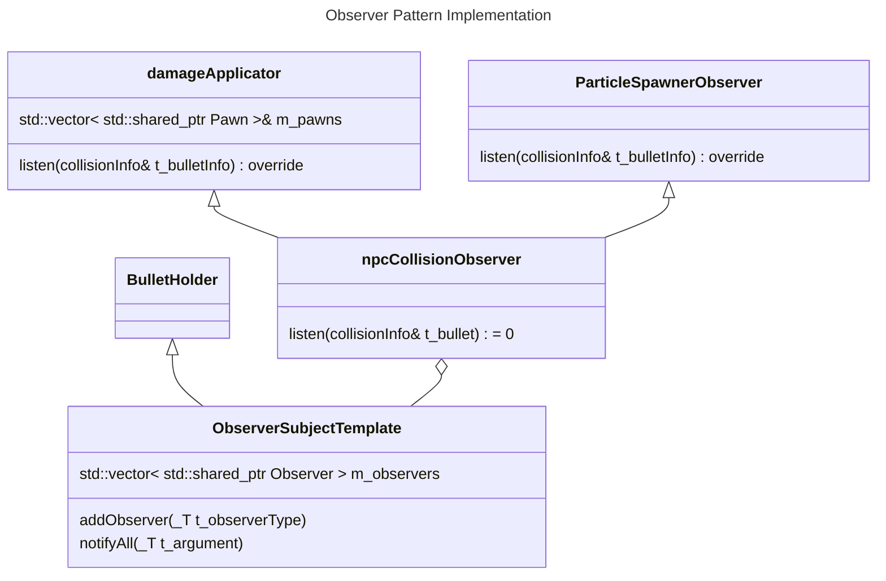

```mermaid
---
title: Observer Pattern Implementation
---
classDiagram
    BulletHolder <|-- ObserverSubjectTemplate
    damageApplicator <|-- npcCollisionObserver
    ParticleSpawnerObserver <|-- npcCollisionObserver
    npcCollisionObserver o-- ObserverSubjectTemplate
    

    class ObserverSubjectTemplate{
        addObserver(_T t_observerType)
        notifyAll(_T t_argument)
        std::vector< std::shared_ptr Observer > m_observers
    }
    class npcCollisionObserver{
    listen(collisionInfo& t_bullet) = 0
    }
    class damageApplicator{
	listen(collisionInfo& t_bulletInfo)override
	std::vector< std::shared_ptr Pawn >& m_pawns
    }
    class ParticleSpawnerObserver{
	listen(collisionInfo& t_bulletInfo)override
    }
    class BulletHolder{

    }
```
