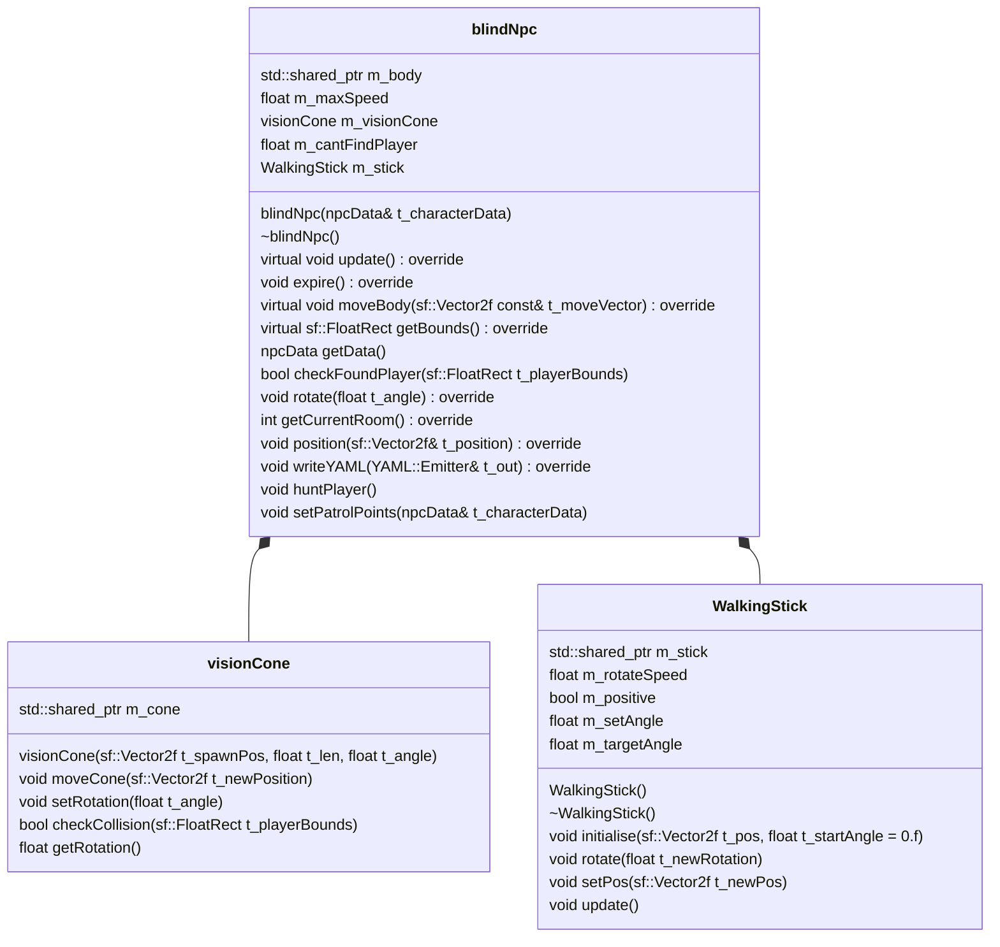

Single Responsibility Principle
Although some of the classes in our game contain a lot of variables and such which were put in for the sake of time, Our game still follows the singles responsibility principle in many ways
One good example for instance is the "RenderObject" class, which is used to do all of the drawing in the game, it simply stores a pointer to the shapes that are needed to be drawn, itterates over them and draws them.
This is great for single responsibility because not only is the potential for changing the rendering code very easy, as it is in one simple class
but it also only handles the direct rendering of the objects, and nothing else.
Another good example is state / command machine contained in the pawn
This is a good example as it doesnt use much information and all it does is move the pawns sprite, even better than that it also uses DIP which i will explore in the DIP part.
Another one of the examples, of which we have many, is the vision cone.
The vision cone is a class solely comprised of its body, and some functions for moving it around.
this class follows many of the SOLID principles such as DIP and of course single responsibility, as all it knows about, is itself

Open/Closed Principle
Some of the main classes created in our game follows the open closed principle very well.
For instance the states class that the npcs and the player uses
This is easily extentible as you can easily add more states and more behaviours on how the enmy will move, but it must use the move function from the player, which just takes a displacement,
where then the pawn decides how to actually move and at what speed
Alot of the classes use the open closed principle when loading in from the yaml file
for instance the player uses the character selection screen, which is open for extension, by just adding the new type name to a switch, enum, and adding one to the amount variable, and adding the info into the yaml file, there is then a new player available for selection, without changing any complicated internal code for speed, size, sprint duration, sprint time and such.

Dependency inversion Principle
Alot of the classes in our game use this principle, but the best examples are the structs such as med body, 
this class uses a function called "uninitialise" to move it off screen(to hide the sprite), set active to false, and to move the collision bounds, so that instead of the gameplay class relying on the types and functions of the specific, rectangle shape, and the sprite.

